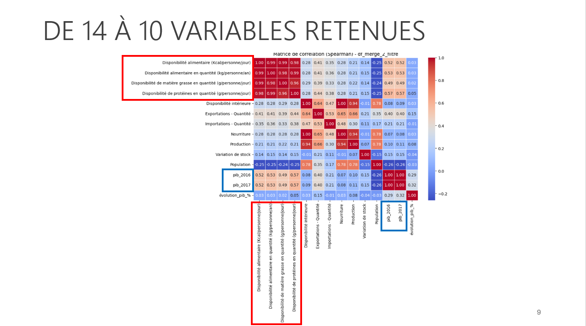
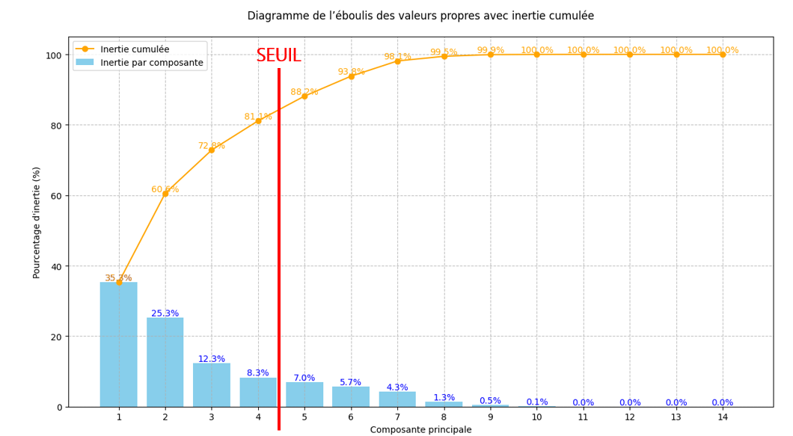
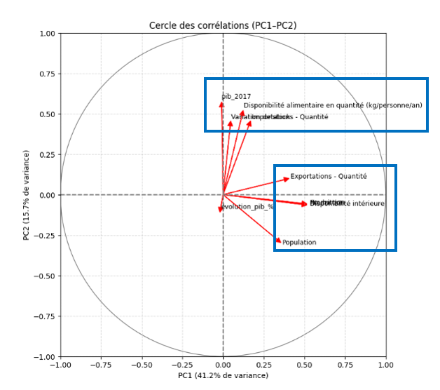
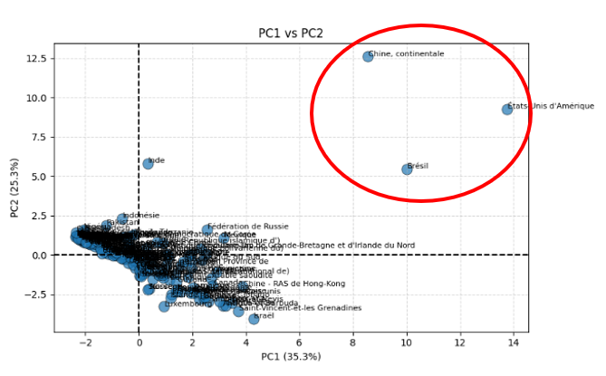
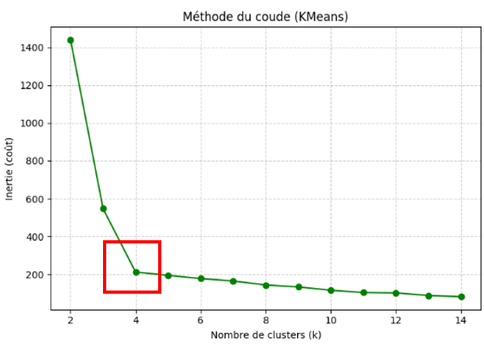
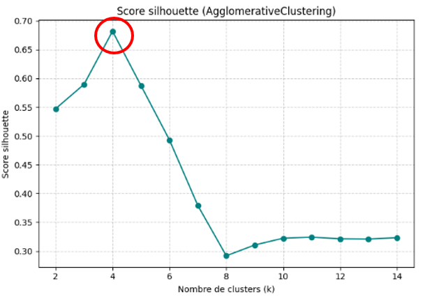
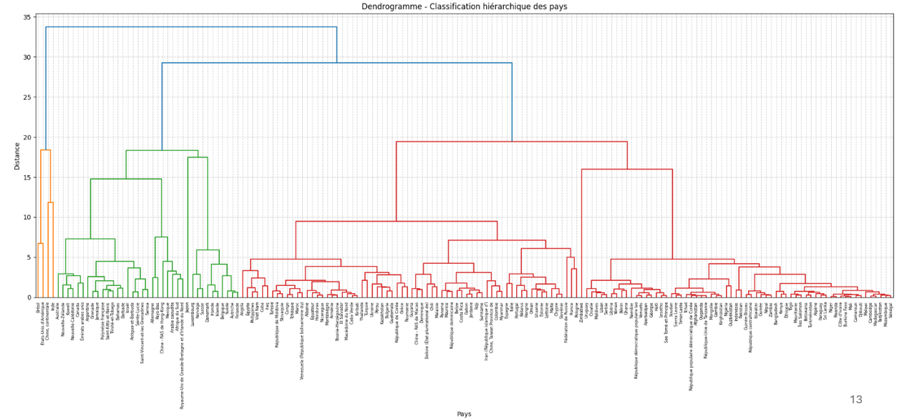
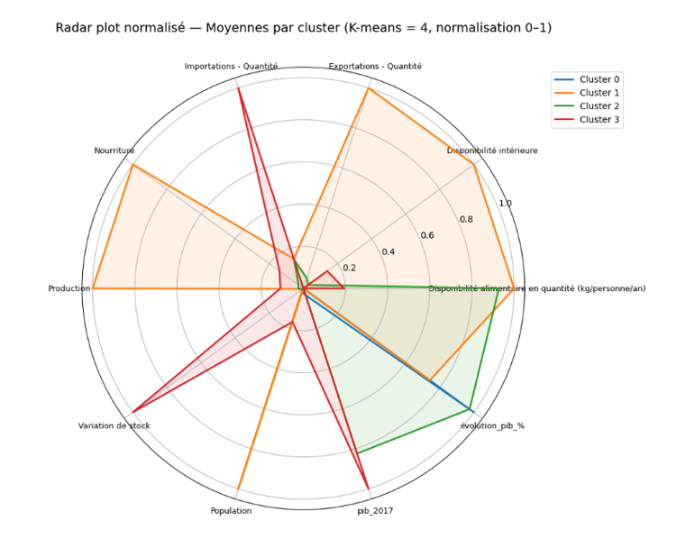

# Projet 11 - Produisez une étude de marché avec Python

## Contexte
Dans le cadre de ce projet, je me positionne en tant que **Data Analyst** pour *La Poule Qui Chante*, une entreprise française du secteur agroalimentaire spécialisée dans l’élevage et la vente de poulets sous le label **« Poulet Agriculture Biologique »**.

L’objectif de la mission est d’**évaluer les opportunités de développement à l’international**, afin d’identifier les marchés et les pays dans lesquels l’entreprise pourrait étendre ses activités et exporter ses produits et son savoir-faire.

---

## Objectifs pédagogiques
- Exploiter des **modèles d’apprentissage** pour mieux comprendre les données
- **Sélectionner les variables pertinentes** pour un modèle d’apprentissage
- Réaliser des **analyses multivariées** afin d’étudier les corrélations entre les variables
- **Réduire la dimension des données** pour optimiser les temps d’apprentissage des modèles

---

## Outils utilisés
- **Python**
  - Analyse de données
  - Méthodes statistiques et de machine learning
  - Visualisation des résultats

---

## Méthodologie & résultats

### Analyse en Composantes Principales (ACP)
La première étape repose sur l’**ACP**, utilisée pour réduire et synthétiser les variables.

- Utilisation de la **matrice de corrélation de Spearman** pour identifier les variables fortement corrélées
- Sélection des variables réellement distinctes
- Réduction du nombre de variables de **14 à 10**

L’**éboulis des valeurs propres** permet ensuite d’identifier le nombre optimal de composantes à conserver, en fonction du pourcentage d’inertie expliquée.

Les **cercles de corrélations** montrent une bonne représentation des variables sélectionnées.  
La projection des individus sur un **plan factoriel** met en évidence **trois pays outliers**, conservés dans l’analyse car stratégiques pour le développement commercial.

---

### Clustering des pays
La seconde étape consiste à regrouper les pays ayant des caractéristiques similaires à l’aide de méthodes de **clustering** :

- **Classification Ascendante Hiérarchique (CAH)**
- **K-means**

Le nombre optimal de clusters est déterminé grâce à :
- la **méthode du coude**
- le **score silhouette**
- le **dendrogramme**

Les résultats convergent vers **4 groupes de pays**.  
Un **radar plot** est utilisé pour comparer et visualiser les caractéristiques de chaque cluster.

---

## Interprétation des clusters

- **Cluster 1 – Super puissances**  
  Chine continentale, États-Unis et Brésil  
  → Grands marchés potentiels mais aussi concurrents majeurs.  
  Une stratégie de **positionnement haut de gamme** est envisageable.

- **Cluster 2 – Marchés intermédiaires (dont la France)**  
  → Choix stratégique entre montée en gamme ou développement par les volumes pour gagner des parts de marché.

- **Cluster 3 – Marché spécifique (Japon)**  
  → Marché unique, très importateur, avec un PIB par habitant élevé.  
  La demande est forte mais nécessite une **adaptation marketing**, une analyse réglementaire et douanière approfondie.

- **Cluster 0**  
  → Non retenu pour la première phase de développement international.

---

## Compétences acquises
- Utilisation d’**algorithmes de clustering**
- Mise en œuvre des méthodes :
  - Méthode du coude
  - Score silhouette
  - Dendrogramme
  - K-means
- Application des techniques d’**ACP** :
  - Matrice de corrélation de Spearman
  - Éboulis des valeurs propres
  - Cercles de corrélations
  - Projection des individus sur un plan factoriel

---

## Illustrations

### Matrice de corrélation de Spearman

### Éboulis des valeurs propres

### Cercle des corrélations (PC1 – PC2)

### Représentation des individus sur le plan factoriel

### Méthode du coude

### Score silhouette

### Dendrogramme

### Radar plot (normalisation)

---

## Conclusion
Ce projet met en évidence l’apport des méthodes statistiques et de machine learning pour **orienter une stratégie de développement international**, en s’appuyant sur une analyse rigoureuse et visuelle des données.

